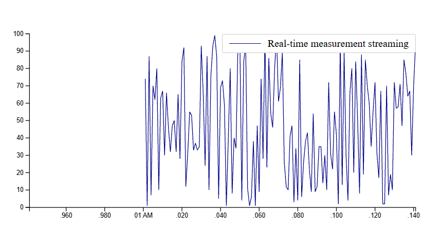

# Python real-time time-series data streaming using FastAPI and WebSockets

Read the blog post: [Real-time data streaming using FastAPI and WebSockets](https://stribny.name/blog/2020/07/real-time-data-streaming-using-fastapi-and-websockets).

<https://huww98.github.io/TimeChart/>

To run the example install Poetry and then execute:

```bash
make install
make run
```

open <http://127.0.0.1:8000/>


